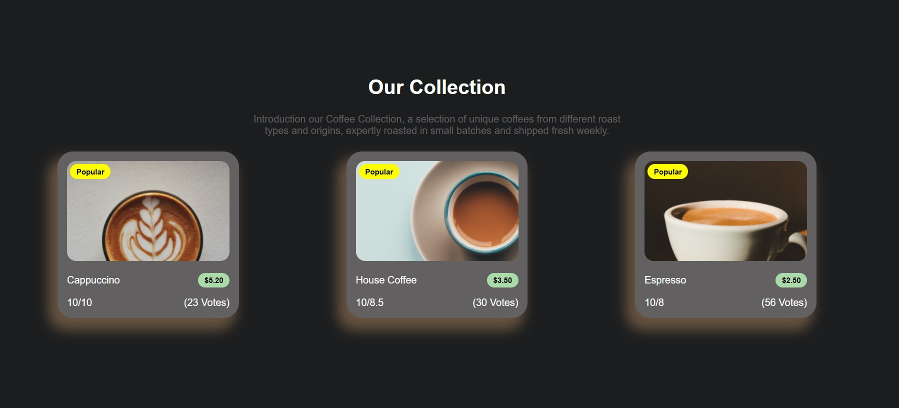
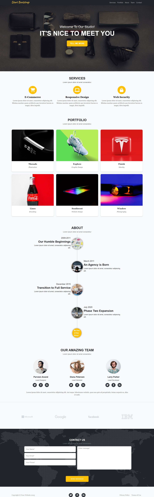

# GDG On Campus DMU Frontend Track Repository

Welcome to the **GDG On Campus DMU Frontend Track** repository! This repository is dedicated to solving tasks and enhancing your frontend development skills. Dive into the tasks below and start building amazing web projects!

Happy coding! 🚀

---

## 📋 Task List

### Task 1: Simple Web Page HTML

- [View Task](Tasks/T1/)

---

### Task 2: Social Links & Recipe Web Page

- [Social Links Profile](Tasks/T2/Social-Links-Profile/)
- [Web Preview](Tasks/T2/Recipe-Page/)

---

### Task 3: House Coffee

- [View Task](Tasks/T3/)

  
🔍 Show Web Preview

  

---

### Task 4: Sound Nap

- [View Task](Tasks/T4/)

  
🔍 Show Web Preview

  

---

### Task 5: Start Bootstrap

- [View Task](Tasks/T5/)

  
🔍 Show Web Preview

  

---

### Task 6: Problem Solving on JavaScript

  
🧩 Problems

  <ol>
    <li><a href="https://leetcode.com/problems/to-be-or-not-to-be/?envType=study-plan-v2&envId=30-days-of-javascript">To Be OR Not To Be</a></li>
    <li><a href="https://leetcode.com/problems/counter-ii/?envType=study-plan-v2&envId=30-days-of-javascript">Counter</a></li>
    <li><a href="https://leetcode.com/problems/remove-duplicates-from-sorted-array/?envType=study-plan-v2&envId=top-interview-150">Remove Duplicates</a></li>
    <li><a href="https://leetcode.com/problems/best-time-to-buy-and-sell-stock/?envType=study-plan-v2&envId=top-interview-150">Best Time To Buy & Sell Stock</a></li>
    <li><a href="https://leetcode.com/problems/majority-element/?envType=study-plan-v2&envId=top-interview-150">Majority Element</a></li>
  </ol>

---

Let’s create something awesome together! 🌟
