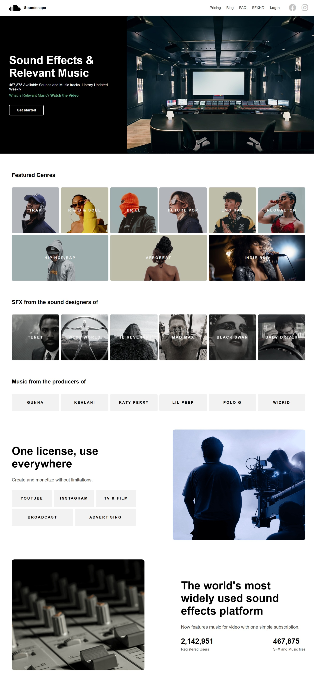

# Special Repo to solve tasks

Welcome to the **GDG On Campus DMU Frontend Track** repository! This special repository is dedicated to solving tasks and enhancing your frontend development skills. Dive into the tasks below and start building amazing web projects!

Happy coding! 🚀

## Task List

### Task 1: Simple Web Page HTML

- [View Task](Tasks/T1/)

### Task 2: Social Links & Recipe Web Page

- [Social Links Profile](Tasks/T2/Social-Links-Profile/)
- [Web Preview](Tasks/T2/Recipe-Page/)

### Task 3: House Coffee

- [View Task](Tasks/T3/)
- 

### Task 4 : Sound Nap

- [View Task](Tasks/T4/)
- 

Let's create something awesome together! 🌟
